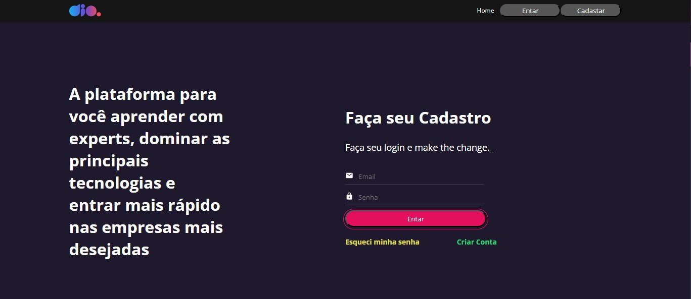
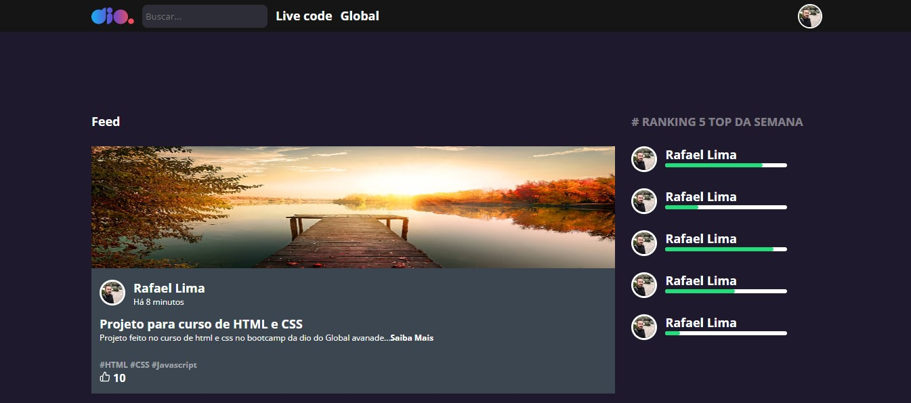

# Dio Clone

Esse foi um dos projetos que desenvolvi enquanto aprendia React, a proposta é desenvolver um clone visual da plataforma da [DIO](https://dio.me/sign-up?ref=9RS1X8XBOV).

## Imagens do projeto

<p align="center">




</p>

## Funcionalidades

- Responsividade
- Navegação entre páginas
- Login com Api interna

## Como rodar o projeto

Para rodar o projeto em sua máquina e testar a aplicação siga os passos abaixo:

Primeiro clone ou baixe o repositório, para isso você pode usar os comandos:


```bash
git clone https://github.com/Rafael7dev/Dio-Clone.git
cd Dio-Clone/

```

Se usa o VsCode e ele não está aberto você pode iniciar a ferramenta direto na pasta raiz usando:
```bash
code .
```
Depois disso para instalar as dependências do projeto use;
```bash
yarn
```
E quando instaladas use:
```bash
yarn start
```
Para testar a autenticação abra um novo terminal e use o comando:
```bash
yarn api
```

### Usuários
Para testar o login após iniciar a Api você pode usar a combinação válida:
| Email            | Senha  |
|------------------|--------|
| rafael@email.com | 123456 |
## Autor

- [@Rafael7dev](https://github.com/Rafael7dev)